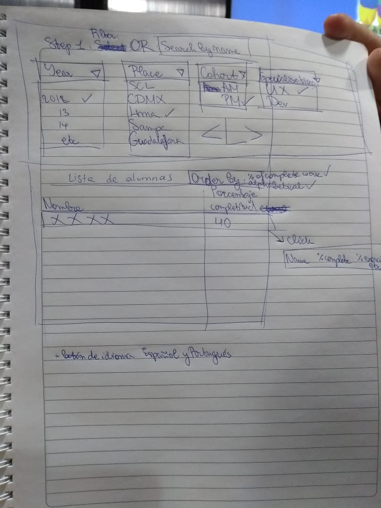

# Data Dashboard

## Preámbulo

En Laboratoria, las Training Managers (TMs) hacen un gran trabajo al analizar la
mayor cantidad de datos posibles respecto al progreso de las estudiantes para
apoyarlas en su aprendizaje.

### User Experience Design

#### 1) Definición del producto

Respuestas en base a entrevista directa con la TM Valentina Smith.

* Quiénes son los principales usarios de producto.

Las TM de Laboratoria.

* Cuáles son los objetivos de estos usarios en relación con el producto.

Poder tomar decisiones en base al progreso de las alumnas de Laboratoria. Es decir,
poder generar instancias de aprendizaje centradas en los contenidos que han resultado 
con mayor dificultad de aprender. Esto se ve reflejado en los porcentajes de 
avance/completitud de la plataforma LMS de Laboratoria. En relación a esos porcentajes,
se puede determinar qué contenidos les está costando más a las alumnas y así, generar instancias de reforzamiento.

* Cuáles son los datos más relevantes que el usuario quiere ver en la interfaz y
  por qué. Cómo los descubriste.

Los resultados de todo el curso para poder tomar decisiones en cuanto a reforzamiento
de los contenidos que más les cuenta a las alumnas. 
Ha sucedido que hay algún ejercicio que la mayoría no ha podido hacer. Entonces, se
dirige la clase en torno a esos problemas puntuales que las alumnas puedan tener.

* Cuándo revisa normalmente estos datos.

A lo largo de la ruta de aprendizaje de las alummnas.

* Cómo fue tu proceso de diseño.

Nuestro proceso de diseño se inició teniendo en cuenta la necesidad para visualizar los
datos requeridos. Buscamos una forma simple y sencilla para dar solución a esta problemática.
Seguido a ello, dibujamos un sketch de la solución (prototipo de baja fidelidad) mientras discutiamos cada componente y su funcionalidad.

#### 3) Diseño de la Interfaz de Usuario (prototipo de alta fidelidad)

Una vez completado el Sketch, diseñamos la Interfaz de Usuario (UI por sus
siglas en inglés). Para esto utilizamos la herramienta de
diseño visual [Figma](https://www.figma.com/).

## Links a figma

* [prototipo en figma](https://www.figma.com/proto/UqXWJ2KS08huu8cFGQiHwP6R/tabla-laboratoria?scaling=min-zoom&node-id=2%3A0)

* [versión móvil](https://www.figma.com/proto/F8I0Zvd5Sdf91MK3am589kc7/mobile-version?scaling=contain&node-id=3%3A92)

=======

## Introducción

## Perfil del usuario:

Training managers de Laboratoria en paises hispanohablantes y Brasil.

## Entrevista inicial del cliente:

Cuáles son tus objetivos en relación con este producto?
Cuando se separan en especializaciones, eso se considera 3 cohorts diferentes? O siguen siendo 2? Quieres marcar la diferencia entre ramas de alguna manera?
Qué información quieres poder ver en la interfaz? Y qué más? Con qué fin?
Completitud de
Al momento de buscar, cómo quieres hacerlo? A través de un menú, o con Buscar/Filter
Cómo te gustaría visualizar la información? Porcentaje, gráfico?
Cuándo revisas estos datos normalmente?

## Cómo nuestro producto resuelva los problemas del cliente principal:

Brinda la información deseada de una manera más atractiva y fácil de resumir. Además es accesible desde móvil y web.

## Design process and decisions:

Empezamos con un sketch básico hecho a la mano para maquetear toda la información que queríamos tener en la versión Web, y luego diseñamos un prototipo de media-alta fidelidad (usando Figma) para la versión móvil:

[version móvil](https://www.figma.com/file/F8I0Zvd5Sdf91MK3am589kc7/mobile-version?node-id=10%3A88)

Usamos los colores del guía de Laboratoria, y estamos esperando la segunda ronda de entrevistas del usuario, por lo que tenemos las siguientes preguntas:

Está clara la información?
Está la simbología óptima?
Es éste el vocabulario que corresponde?
Hay requirimentos que no están expresados?

